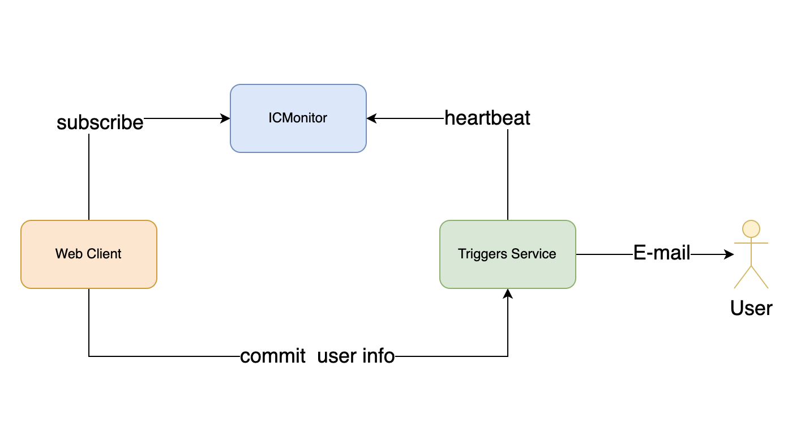

# ICMonitor

**Website:** http://ICMonitor.io  
**Canister id:** 73hjh-6qaaa-aaaak-aacaq-cai  
**ModuleHash:** 7500f02327d8c6e6df96b33ba92f88e039b3103c631f3efe0868ea2e7b2894c9

## 简介（Overview）

ICMonitor 是一个Canister管理和提醒工具，也是一个外部定时触发器。通过心跳机制（Heartbeat）监测Canister的状态，并在必要时发送邮件提醒。项目包括Canister代码、前端代码、触发器Service。

## 工作原理 （How it works）



用户通过UI界面可以监视Canister的各种状态变化，触发器Service定时向ICMonitor获取订阅消息，并发送邮件提醒给用户。

订阅容器：用户在UI界面对要监视的Canister进行设置，并向提醒服务提供者登记email地址。

ICMonitor提供的监视类型包括：

- Canister的运行状态
- Canister内存使用超过阈值
- Canister内存使用接近了预分配的内存空间
- Canister的Cycles低于阈值
- Canister的Controllers被修改
- Canister进行了升级，ModuleHash发生了改变

如果你订阅了Cycles不足提醒，并且想让ICMonitor自动帮你续费，参见“如何使用”的Step3部分。

可以将ICMonitor当作定时触发器使用：

- 你的Canister实现timer_tick()函数，并在ICMonitor中订阅TimerTick进行设置。
- ICMonitor会在执行Heartbeat时，触发所有订阅了TimerTick的Canister。

注意：

由于ICMonitor受IC网络机制限制，无法直接获取Canister的状态。如果需要使用ICMonitor监视Canister，需要将Blackhole(73hjh-6qaaa-aaaak-aacaq-cai)添加为controller之一，或者将Canister自己添加为controller之一并实现`canister_status : () -> ()`函数。

参见“如何使用”的Step1部分。

## 如何使用（命令行界面与ICMonitor合约交互）

Notes: UI界面 http://ICMonitor.io

### 订阅（Subscribe）

#### Step1 准备阶段

为了让ICMonitor能获取到Canister的状态，请选择以下两种方式之一进行操作：

**Option 1:** 

设置Blackhole(73hjh-6qaaa-aaaak-aacaq-cai)为你的Canister的controller之一。

````
dfx canister --network ic call aaaaa-aa update_settings '(record {canister_id=principal "<your_canister_id>"; settings= record {controllers=vec {principal "<your_controller_principal>"; principal "73hjh-6qaaa-aaaak-aacaq-cai"}}})'
````
    
    **关于Blackhole**
    
    使用blackhole canister作为代理容器对你的canister状态进行监视，在使用前需要将blackhole canister设置为你容器的controller之一。
    blackhole canister的controller已经修改为其自身canister id，请放心设置。关于Blackhole信息如下：  
    
    Canister id:  7hdtw-jqaaa-aaaak-aaccq-cai  
    ModuleHash(dfx: 0.8.4):  603692eda4a0c322caccaff93cf4a21dc44aebad6d71b40ecefebef89e55f3be  
    Controllers:  7hdtw-jqaaa-aaaak-aaccq-cai （其Controller已经修改为自己，没有人能修改该合约代码）  
    Github:  https://github.com/iclighthouse/ICMonitor/blob/main/Blackhole.mo


**Option 2:**  

在你的canister中实现canister_status()函数，并将它自己的canister_id设置为controller之一。

实现canister_status()示例：

````
import Monitee "./lib/Monitee"; // https://github.com/iclighthouse/ICMonitor/blob/main/lib/Monitee.mo
.......
    public func canister_status() : async Monitee.canister_status {
        let ic : Monitee.IC = actor("aaaaa-aa");
        await ic.canister_status({ canister_id = Principal.fromActor(this) });
    };
.......

````

设置自己的canister_id为controller之一：

````
dfx canister --network ic call aaaaa-aa update_settings '(record {canister_id=principal "<your_canister_id>"; settings= record {controllers=vec {principal "<your_controller_principal>"; principal "<your_canister_id>"}}})'
````

#### Step2 向ICMonitor提交订阅

注：也可以在UI界面操作。

示例操作订阅：（1）当Cycles低于100000000000时；（2）当Controller被修改时。
````
dfx canister --network ic call 73hjh-6qaaa-aaaak-aacaq-cai subscribe '(record {canister= principal "<your_canister_id>";enAutoRenewal=false;renewalValue=0:nat;subEventTypes=vec {variant {CyclesLessThan=100000000000:nat};variant {ControllersChanged}}})'
````
如果你想让ICMonitor帮你自动续费，需要在订阅时指定enAutoRenewal=true;并设置每次续费多少ICP renewalValue=[e8s_value]; IMonitor会自动帮你转换为Cycles，并存入你的Canister。前提条件是：你需要往ICMonitor预充值ICP（需要操作Step3步骤）。
````
dfx canister --network ic call 73hjh-6qaaa-aaaak-aacaq-cai subscribe '(record {canister= principal "<your_canister_id>";enAutoRenewal=true;renewalValue=<icp_e8s_value>:nat;subEventTypes=vec {variant {CyclesLessThan=100000000000:nat};variant {ControllersChanged}}})'
````

#### (Optional) Step3 向ICMonitor预充值ICP

（1）获取AccountId
```
dfx canister --network ic call 73hjh-6qaaa-aaaak-aacaq-cai getAccountId '(principal "<your_account_principal>")'
```
得到DepositAccountId

（2）充值ICP
```
dfx ledger --network ic transfer <your_DepositAccountId> --memo 0 --e8s <icp_e8s_amount>
```
（3）查询ICP余额
```
dfx canister --network ic call 73hjh-6qaaa-aaaak-aacaq-cai icpBalance
```
（4）Optional 取回ICP
```
dfx canister --network ic call 73hjh-6qaaa-aaaak-aacaq-cai icpWithdraw '(<icp_e8s_amount>:nat)'
```

#### Step4 查询订阅状态

````
dfx canister --network ic call 73hjh-6qaaa-aaaak-aacaq-cai subscription '(principal "<your_canister_id>", opt principal "<your_account_principal>")'
````

#### Step5 获取订阅事件

````
dfx canister --network ic call 73hjh-6qaaa-aaaak-aacaq-cai getEvents '(opt principal "<your_canister_id>", opt principal "<your_account_principal>", null, null)'
````

### 取消订阅

````
dfx canister --network ic call 73hjh-6qaaa-aaaak-aacaq-cai unsubscribe '(principal "<your_canister_id>", principal "<your_account_principal>")'
````

## Roadmap

- (doing) 完善UI界面
- 使用IC内部Heartbeat触发监视事件
- 使用Dmail发送Email提醒，实现完全去中心化。

